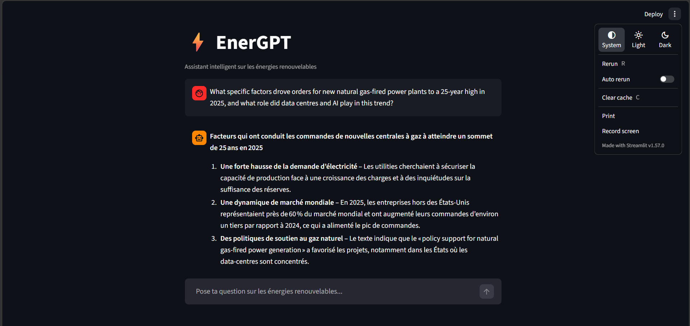
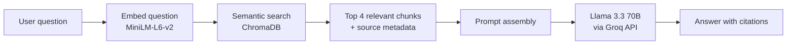

# ⚡ EnerGPT

> An AI assistant for renewable energy, grounded in 23 official IEA & IRENA reports.

EnerGPT answers natural-language questions about solar, wind, hydro, and the energy transition — and cites the exact report and page each answer comes from. Built as a **Retrieval-Augmented Generation (RAG)** pipeline with a 100% free stack.


---

## 📸 Demo



---

## ✨ Features

- **Grounded answers** — every response is based on real passages from IEA and IRENA reports
- **Source-cited** — each answer references the exact PDF and page
- **Clean chat UI** — built with Streamlit, with persistent conversation history
- **Fully local retrieval** — the vector database and embeddings run on your own machine
- **100% free stack** — no OpenAI, no paid embeddings, no cloud database

---

## 🏗️ How it works

EnerGPT follows the standard RAG pattern:



1. **Ingestion** — 23 PDF reports are read page-by-page and split into ~1,000-character chunks (200-char overlap) using LangChain's `RecursiveCharacterTextSplitter`
2. **Indexing** — each chunk is embedded with `all-MiniLM-L6-v2` and stored in a persistent ChromaDB collection (~8,100 chunks total)
3. **Retrieval** — at query time, the 4 most semantically similar chunks are retrieved
4. **Generation** — Llama 3.3 70B (via Groq) generates an answer using only the retrieved context, with instructions to cite sources and admit when information is missing

---

## 🛠️ Tech stack

| Layer | Tool |
|---|---|
| Language | Python 3.11 |
| PDF parsing | `pypdf` |
| Text splitting | LangChain — `RecursiveCharacterTextSplitter` |
| Embeddings | `sentence-transformers` — `all-MiniLM-L6-v2` (local, free) |
| Vector store | ChromaDB (local, persistent) |
| LLM | Llama 3.3 70B via Groq API |
| Web UI | Streamlit |
| Config | `python-dotenv` |

---

## 📦 Installation

### Prerequisites

- Python **3.11**
- A free **Groq API key** — [console.groq.com](https://console.groq.com)

### Setup

**1. Clone the repository**
```bash
git clone https://github.com/<your-username>/enerGPT.git
cd enerGPT
```

**2. Create and activate a virtual environment**
```bash
# Windows
py -3.11 -m venv venv
.\venv\Scripts\activate

# macOS / Linux
python3.11 -m venv venv
source venv/bin/activate
```

**3. Install dependencies**
```bash
pip install -r requirements.txt
```

**4. Add your Groq API key**

Create a `.env` file at the project root:
```env
GROQ_API_KEY=your_key_here
```

**5. Add the PDFs**

Create a `data/` folder at the project root and drop the IEA / IRENA reports (or any PDFs you want to query) inside.

> ⚠️ PDFs are **not** included in the repository due to file size and licensing. Public reports can be downloaded from [iea.org](https://www.iea.org) and [irena.org](https://www.irena.org).

---

## 🚀 Usage

### Step 1 — Build the vector database (one-time)

```bash
python build_database.py
```

Reads every PDF in `data/`, splits them into chunks, computes embeddings, and saves everything to `chroma_db/`. Expect a few minutes on first run (the embedding model is downloaded once).

### Step 2 — Launch the web app

```bash
streamlit run app.py
```

Open the URL shown in the terminal (usually `http://localhost:8501`) and start asking questions.

### Alternative — Terminal mode

```bash
python chatbot.py
```

Type `quit` to exit.

---

## 📂 Project structure

```
enerGPT/
├── data/                 # PDF reports (gitignored — add your own)
├── chroma_db/            # Persistent vector store (auto-generated, gitignored)
├── ingest.py             # Exploration script — reads and chunks PDFs, prints stats
├── build_database.py     # Builds the ChromaDB vector store from data/
├── chatbot.py            # CLI version of the assistant
├── app.py                # Streamlit web app
├── requirements.txt      # Python dependencies
├── .env                  # Groq API key (gitignored)
├── .gitignore
└── README.md
```

---

## 📊 Data sources

The knowledge base was built from **23 official reports** published by:

- **IEA** — International Energy Agency
- **IRENA** — International Renewable Energy Agency

Topics covered include solar PV, wind power, hydropower, bioenergy, policy outlooks, and the global energy transition.

---

## ⚠️ Limitations

- Answers are only as good as the source corpus — no reasoning beyond what's in the retrieved passages
- Retrieval always returns 4 chunks, even for off-topic questions
- No cross-turn memory: each question is answered independently of previous ones
- The embedding model is English-centric — non-English queries may retrieve less relevant passages
- The current UI is in French (easy to translate — see `app.py`)

---

## 🔮 Roadmap / possible improvements

- [ ] Display retrieved sources directly in the Streamlit UI (currently returned but not shown)
- [ ] Multi-turn conversation memory
- [ ] Reranking of retrieved chunks (e.g. with a cross-encoder)
- [ ] Multilingual embeddings for French and Arabic reports
- [ ] Metadata filters (by year, by publisher)
- [ ] Deployment on Streamlit Community Cloud or Hugging Face Spaces

---

## 📄 License

Academic project — free to reuse and adapt for educational purposes.
<!-- If you want a formal license, MIT is a good default for personal/academic code. -->

---

## 👤 Author

**Ranim Sabri**
Academic project — December 2025 → February 2026

---

## 🙏 Acknowledgments

- **IEA** and **IRENA** for making their reports publicly available
- **Groq** for their free LLM inference API
- The open-source community behind **LangChain**, **ChromaDB**, and **sentence-transformers**
